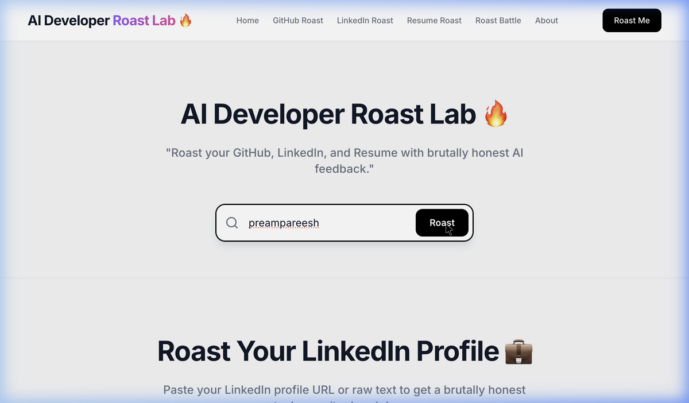
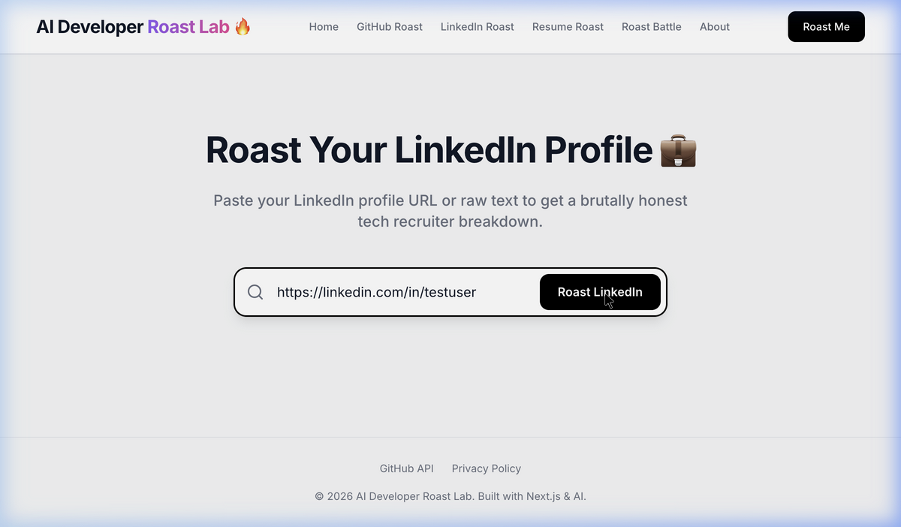
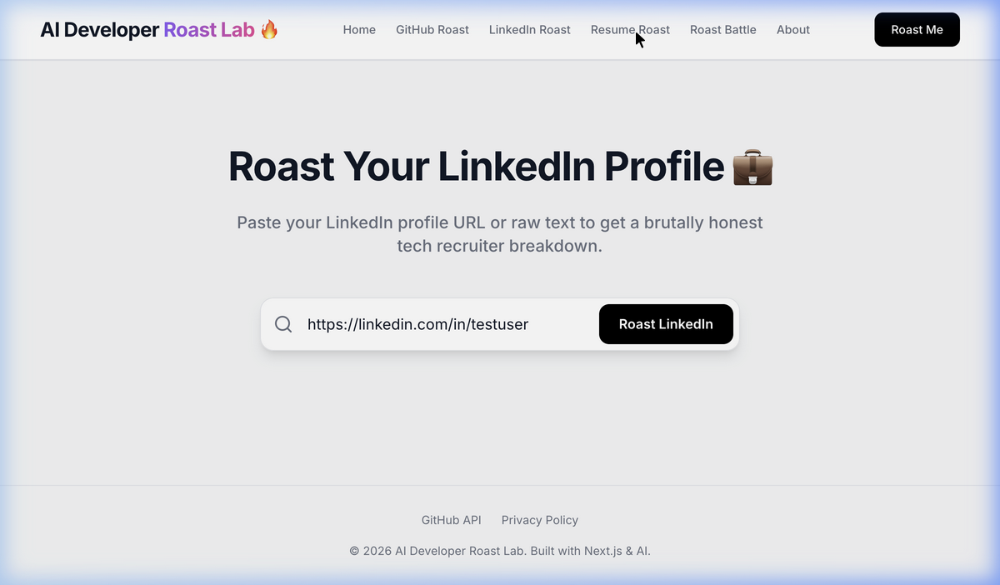
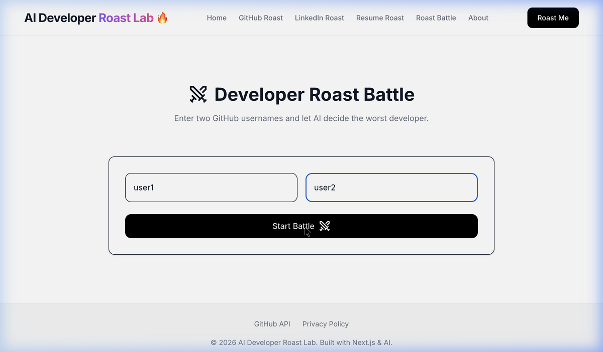

# AI Developer Roast Lab 🔥

<p align="center">
  
</p>

<p align="center">
  
  
  
  
  
  
</p>

---

## 🚀 Overview

**AI Developer Roast Lab** is a high-octane, AI-powered platform designed to provide brutally honest, humorous, and deeply insightful feedback on your professional developer presence. Whether it's your GitHub repositories, LinkedIn profile, or your "carefully crafted" resume, our AI will find the gaps, the generic buzzwords, and the tutorial-graveyards.

> "A powerful platform that brutally analyzes GitHub, LinkedIn, and resumes and generates humorous yet insightful developer roasts."

<p align="center">
  <a href="https://githubroast2-0-frontend.onrender.com">
    
  </a>
</p>

---

## ✨ Features

- **🔥 GitHub Roast**: Analyzes your code style, repository variety, and star-to-originality ratio.
- **🔗 LinkedIn Roast**: Tears apart your "Visionary" headlines and generic endorsements.
- **📄 Resume Roast**: Scans your PDF/TXT resumes for "Detail Oriented" clichés and font crimes.
- **⚔️ Roast Battle**: Pit two GitHub profiles against each other to see who survived the tutorial hell.
- **📊 Developer Scoring**: Get a metric-based breakdown of your actual impact.
- **🤖 AI-powered Feedback**: Powered by advanced LLMs (Llama 3 / NVIDIA AI) for human-like wit.

---

## 📸 Screenshots

| GitHub Roast | LinkedIn Roast |
| :---: | :---: |
|  |  |

| Resume Roast | Roast Battle |
| :---: | :---: |
|  |  |

---

## 🛠 Tech Stack

### Frontend
- **Framework**: Next.js 15 (App Router)
- **Language**: TypeScript
- **Styling**: TailwindCSS
- **Animations**: Framer Motion
- **Icons**: Lucide React

### Backend
- **Server**: Node.js & Express.js
- **Middleware**: Multer (File Uploads), CORS
- **Parsing**: pdf-parse
- **AI Integration**: NVIDIA AI / Groq / OpenAI SDKs

### Deployment & DevOps
- **Hosting**: Render
- **Containerization**: Docker
- **Caching**: Local Memory / Disk

---

## ⚙️ How It Works

1. **Enter Profile**: Paste a GitHub username, LinkedIn URL, or upload a Resume.
2. **Data Extraction**: The backend fetches live data from GitHub APIs or parses your documents.
3. **AI Synthesis**: Data is processed and sent to our AI model with a specialized "toxic recruiter" persona.
4. **Instant Roast**: Results are streamed back or displayed with a comprehensive score and actionable insights.

---

## 📁 Project Structure

```text
/
├── frontend/           # Next.js Application
│   ├── src/app         # Routes and Pages
│   └── src/components  # Visual UI pieces
├── backend/            # Express Server
│   ├── src/controllers # Logic and API handlers
│   └── src/services    # AI and GitHub integrations
└── README.md           # You are here
```

---

## 🔮 Future Improvements

- [ ] **Voice Roast**: Get roasts read to you by an AI agent.
- [ ] **GitHub Analytics Dashboard**: Deeper commit-history analysis.
- [ ] **Resume Optimizer**: Automated suggestions to actually get hired.
- [ ] **Social Sharing**: One-click sharing to Twitter (X) and LinkedIn.

---

## 🤝 Contributing

Contributions are welcome! If you have a better roast prompt or a new feature idea, feel free to open a PR.

---

<p align="center">
  Built with ❤️ using <b>Next.js</b> and <b>AI</b>. <br/>
  © 2026 AI Developer Roast Lab.
</p>